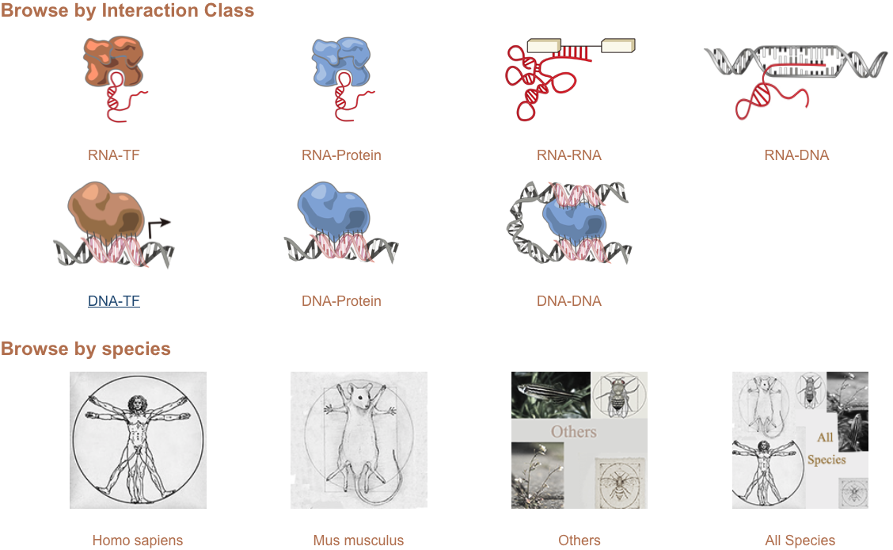

# lncRInter

> [lncRInter: A database of experimentally validated long non-coding RNA interaction](http://www.sciencedirect.com/science/article/pii/S167385271730019X) Chun-Jie Liu, Changhan Gao, Zhaowu Ma, Renhuai Cong ,Qiong Zhang* ,An-yuan Guo* Journal of Genetics and Genomics 2017;doi:10.1016/j.jgg.2017.01.004

# Introduction
lncRInter is reliable and high quality lncRNA interaction database containing experimentally validated data. The lncRNA interaction datasets are all extractd from peer-reviewed publications by our curators with strict criteria that there were certain experimental evidence (e.g. RNA pull-down, luciferase reporter assay, in vitro binding assay, etc.) for direct lncRNA interactions.

# Datasets

